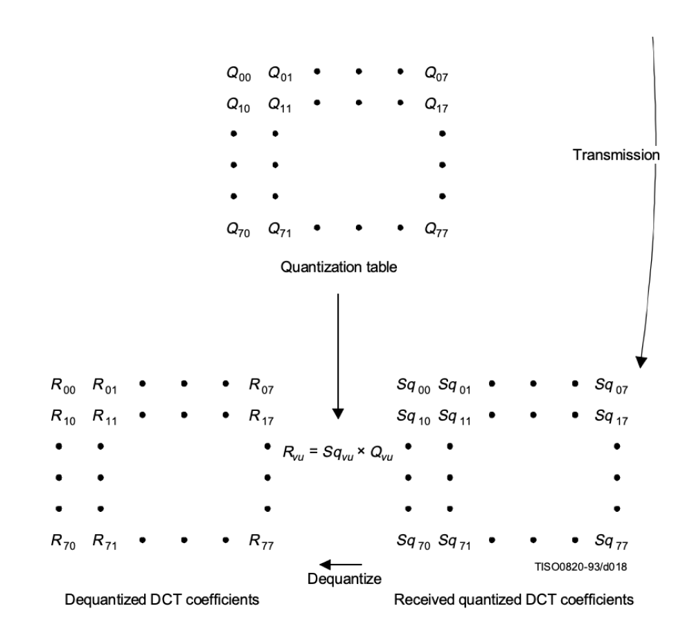

# jpeg-decoder

A decoder following the [ITU-T.81 Specification](https://www.w3.org/Graphics/JPEG/itu-t81.pdf).
<br />

<p align="center">
    
    
</p>

```rust
use jpeg::prelude::*;

fn main() -> anyhow::Result<()> {
    let mut decoder = Decoder {
        mmap: unsafe { Mmap::map(&File::open("mike.jpg")?)? },
        cursor: 0,
        encoding: CodingProcess::BaselineDCT,
    };

    let ycbcrs: Vec<ColorSpace> = decoder.decode()?;
    let rgbs = ColorSpace::convert_ycbcr_to_rgb(ycbcrs);

    Ok(())
}
```

## Coding Process

The decoder uses baseline sequential as its coding process.
For other coding processes, see `CODING_PROCESSES.md`.

## Portable SIMD

`jpeg` makes use of portable SIMD throughout various steps of the decoding process, as well as color space conversion
and grayscaling. For example, consider dequantization:



This can be easily vectorized, simply cast the quantization table and coefficients into `Simd<u8, 64>` and perform a
lane-multiplication with each other.

Such trivial cases also exist during coefficient level-shifting and marker segment parsing.

